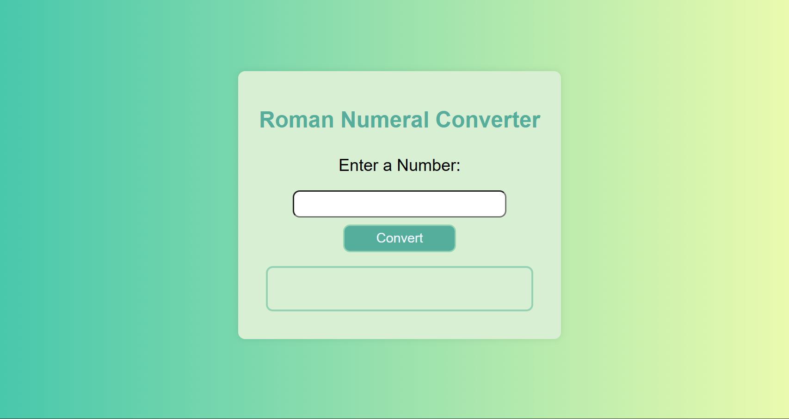

# roman-numeral-converter 🚀

## Overview📝

This project is a simple web-based application that converts numbers to Roman numerals. The application takes a number input from the user, validates the input, and displays the corresponding Roman numeral. The valid range for conversion is from 1 to 3999, as Roman numerals do not have a standard representation for numbers outside this range.

## Demo 📸

## deployment link

https://faridafaqiri.github.io/Roman-numeral-converter/

## Features

- User Input Validation: Ensures the input is a valid number within the     specified range.
- Instant Conversion: Converts the number to a Roman numeral upon clicking the "Convert to Roman Numeral" button.
- Clear Error Messages: Provides meaningful error messages for invalid inputs.

## Technologies Used 🛠️

- HTML
- CSS
- Javascript

## Getting Started

Prerequisites
To run this project, you only need a web browser

## Installation 💻

1. Clone the repository on your local machine
   git clone <git@github.com>:faridafaqiri/roman-numeral-converter.git
2. Navigate to the project directory:
   cd roman-numeral-converter
3. Open index.html in your web browser to run the application.

## Usage

1. Enter a number between 1 and 3999 in the input field.
2. Click the "Convert" button.
3. The Roman numeral equivalent of the entered number will be displayed below the button.
4. If the input is invalid, an appropriate error message will be shown.

## Code Overview

HTML (index.html)

- Basic structure with an input field, a button, and a paragraph to display the output.

CSS(styles.css)

- The CSS file styles the web application to make it visually appealing. It uses a modern, clean design with responsive features for smaller screens

JavaScript (script.js)

- Adds an event listener to the button for handling the conversion.
- Validates the input to ensure it's a number within the acceptable range.
- Defines the toRoman function that maps numbers to Roman numerals using an array of numeral-value pairs and constructs the Roman numeral string.

## Contributing

Contributions are welcome! Please feel free to submit a Pull Request.

## Author 👩‍💻

You can contact me through the following:

- LinkedIn: (<https://www.linkedin.com/in/farida-faqiri-071a31309/>)
- Email: (<farida.faqiri2@gmail.com>)
